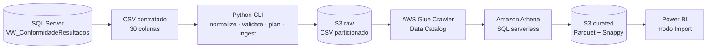

<div align="center">

# Qualidade Ambiental AWS Data Lake

**Pipeline serverless e orientado por contrato para dados de qualidade da agua e esgoto.**

Do SQL Server ao Parquet, com validacao local, catalogacao no Glue, consultas no Athena e consumo no Power BI.

[](https://github.com/engambientalucas-design/QualidadeAmbiental_AWS_DataLake/actions/workflows/ci.yml)
[](https://github.com/engambientalucas-design/QualidadeAmbiental_AWS_DataLake/releases)
[](https://www.python.org/)
[](https://aws.amazon.com/)
[](https://powerbi.microsoft.com/)
[](./LICENSE)

[Visao geral](#visao-geral) · [Arquitetura](#arquitetura) · [Instalacao](#instalacao) · [Uso](#uso) · [Roadmap](#roadmap)

</div>

---

## Visao geral

O **Qualidade Ambiental AWS Data Lake** e um projeto derivado do contrato externo de dados
v2.1.0 do [`QualidadeAmbiental_SQLServer`](https://github.com/engambientalucas-design/QualidadeAmbiental_SQLServer).
Ele recebe o CSV consolidado pela view `dbo.VW_ConformidadeResultados`, valida o contrato antes
de qualquer chamada a nuvem e prepara o lote para consumo analitico em uma arquitetura em camadas.

### Problema

Exportacoes analiticas podem chegar sem cabecalho, conter `NULL` literal, quebrar tipos esperados,
duplicar resultados ou ser carregadas novamente na mesma particao. Sem controles explicitos, esses
problemas contaminam indicadores e tornam a origem dos dados dificil de auditar.

### Solucao

O projeto implementa uma CLI Python que:

- normaliza exportacoes do SSMS para o contrato oficial de 30 colunas;
- valida tipos, datas ISO, decimais, nulos, unicidade e flags de conformidade;
- recusa particoes raw ou curated preexistentes;
- envia o CSV para uma particao `ingestion_date` no Amazon S3;
- executa e acompanha o AWS Glue Crawler;
- compara contagens locais, raw e curated antes de concluir a carga;
- gera a transformacao Athena para Parquet com compressao Snappy.

> **Status da v0.1.0:** a fundacao AWS e a integracao com Power BI foram validadas manualmente de
> ponta a ponta para a particao `2026-06-22`. O orquestrador Python esta implementado e coberto por
> testes automatizados com clientes AWS simulados. A primeira execucao automatizada de um novo lote,
> usando uma identidade de ingestao dedicada, permanece no roadmap.

## Arquitetura



Uma unica conta AWS e um unico bucket podem hospedar os prefixos abaixo:

```text
s3://<bucket>/raw/dados_conformidade/ingestion_date=YYYY-MM-DD/
s3://<bucket>/curated/dados_conformidade/ingestion_date=YYYY-MM-DD/
s3://<bucket>/athena-results/
```

### Responsabilidades por camada

| Camada | Responsabilidade |
| --- | --- |
| SQL Server | Fonte oficial e classificacao de conformidade |
| Python | Normalizacao, contrato, protecoes e orquestracao |
| S3 raw | Preservacao do CSV contratado por data de ingestao |
| Glue | Descoberta de esquema e registro de particoes |
| Athena | Validacao SQL e transformacao para a camada curated |
| S3 curated | Dados tipados em Parquet/Snappy |
| Power BI | Modelo semantico e visualizacao em modo Import |

## Demonstracao verificavel

O lote didatico versionado permite reproduzir a validacao local sem credenciais AWS:

```powershell
$env:PYTHONPATH = "src"
python -m qa_datalake validate data\sample\dados_conformidade_v2_1_0.csv --baseline
```

Saida esperada:

```json
{
  "rows": 72,
  "columns": 30,
  "unique_samples": 6,
  "unique_parameters": 12,
  "with_limit": 57,
  "without_limit": 15,
  "conformant": 50,
  "non_conformant": 7
}
```

Os mesmos indicadores foram conferidos no Athena e no Power BI durante a validacao da fundacao AWS.

## Principais funcionalidades

- **Contrato antes da nuvem:** validacao local ocorre antes de qualquer API AWS.
- **Normalizacao controlada:** adiciona o cabecalho oficial e converte `NULL` literal em campo vazio.
- **Carga idempotente por rejeicao:** uma particao existente bloqueia nova escrita.
- **Sincronizacao segura do crawler:** ignora o resultado anterior e aguarda a execucao atual.
- **Gates de contagem:** CSV local, tabela raw e tabela curated devem apresentar o mesmo total.
- **SQL protegido:** nomes de banco e tabela passam por validacao antes da geracao das consultas.
- **Configuracao externa:** nomes de recursos ficam no `.env`; credenciais permanecem fora do Git.
- **Testes sem nuvem:** a suite usa `unittest` e clientes simulados para validar a orquestracao.

## Baseline validado

| Indicador | Valor esperado |
| --- | ---: |
| Resultados analiticos | 72 |
| Resultados com limite de referencia | 57 |
| Resultados sem limite de referencia | 15 |
| Resultados conformes com limite | 50 |
| Resultados nao conformes com limite | 7 |

O baseline e opcional e representa apenas o dataset didatico v2.1.0. Novos lotes validos podem
ter totais diferentes.

## Requisitos

### Para validacao local

- Git;
- Python 3.11 ou superior.

### Para ingestao AWS

- AWS CLI configurado com uma identidade de ingestao nao-root;
- `boto3` e `python-dotenv`, instalados pelo projeto;
- bucket S3 com os prefixos raw, curated e athena-results;
- Glue Crawler e bancos do Data Catalog existentes;
- tabela curated e workgroup Athena existentes;
- permissoes minimas para os recursos declarados no `.env`.

> A identidade restrita usada pelo Power BI nao deve ser reutilizada para ingestao.

## Instalacao

### Windows PowerShell

```powershell
git clone https://github.com/engambientalucas-design/QualidadeAmbiental_AWS_DataLake.git
Set-Location QualidadeAmbiental_AWS_DataLake

py -m venv .venv
.venv\Scripts\Activate.ps1

python -m pip install --upgrade pip
pip install -e ".[dev]"

Copy-Item .env.example .env
```

### Linux ou macOS

```bash
git clone https://github.com/engambientalucas-design/QualidadeAmbiental_AWS_DataLake.git
cd QualidadeAmbiental_AWS_DataLake

python3 -m venv .venv
source .venv/bin/activate

python -m pip install --upgrade pip
pip install -e ".[dev]"

cp .env.example .env
```

## Configuracao

Preencha o `.env` somente com nomes de recursos. Nao inclua Access Key ID, Secret Access Key ou
Session Token nesse arquivo.

```dotenv
QA_AWS_REGION=us-east-1
QA_S3_BUCKET=replace-with-your-bucket-name
QA_RAW_PREFIX=raw/dados_conformidade
QA_GLUE_CRAWLER=qa-dados-conformidade-raw-crawler
QA_ATHENA_WORKGROUP=qa-qualidade-ambiental-wg
QA_RAW_DATABASE=qualidade_ambiental_raw
QA_RAW_TABLE=raw_dados_conformidade
QA_CURATED_DATABASE=qualidade_ambiental_curated
QA_CURATED_TABLE=dados_conformidade
QA_POLL_SECONDS=5
QA_TIMEOUT_SECONDS=600
```

As credenciais sao resolvidas pela cadeia padrao do AWS SDK. Para desenvolvimento local, prefira
um perfil AWS CLI baseado em IAM Identity Center ou outra forma de credencial temporaria.

## Uso

### Normalizar uma exportacao do SSMS

Use quando o arquivo nao tiver cabecalho ou contiver `NULL` literal:

```powershell
qa-datalake normalize data\input\export_ssms.csv data\output\dados_conformidade.csv
```

### Validar localmente

```powershell
qa-datalake validate data\output\dados_conformidade.csv
```

Para exigir os totais do lote didatico:

```powershell
qa-datalake validate data\sample\dados_conformidade_v2_1_0.csv --baseline
```

### Visualizar o plano sem acessar a AWS

```powershell
qa-datalake plan data\output\dados_conformidade.csv --ingestion-date 2026-07-01
```

### Ingerir um novo lote

```powershell
qa-datalake ingest data\output\dados_conformidade.csv --ingestion-date 2026-07-01
```

> Nao execute o lote de amostra contra `2026-06-22`: essa particao ja existe no ambiente usado
> para validar a fundacao AWS e sera corretamente rejeitada.

O procedimento operacional e as regras de recuperacao estao no
[`docs/runbook.md`](./docs/runbook.md).

## Testes

### Windows PowerShell

```powershell
$env:PYTHONPATH = "src"
python -m unittest discover -s tests -v
```

### Linux ou macOS

```bash
PYTHONPATH=src python -m unittest discover -s tests -v
```

A suite atual possui 11 testes para contrato CSV, normalizacao, SQL Athena, sincronizacao do
crawler, orquestracao simulada e baseline versionado. O mesmo comando e executado pelo GitHub
Actions em pushes e pull requests.

## Estrutura do repositorio

```text
QualidadeAmbiental_AWS_DataLake/
├── .github/
│   └── workflows/
│       └── ci.yml
├── data/
│   └── sample/
│       └── dados_conformidade_v2_1_0.csv
├── docs/
│   ├── adr/
│   │   └── 0001-separate-derived-project.md
│   └── runbook.md
├── src/
│   └── qa_datalake/
├── tests/
├── .env.example
├── .gitignore
├── CHANGELOG.md
├── LICENSE
├── pyproject.toml
└── README.md
```

## Stack

| Tecnologia | Uso no projeto |
| --- | --- |
| Python 3.11+ | CLI, validacao de contrato e orquestracao |
| boto3 | Integracao com APIs AWS |
| Amazon S3 | Zonas raw e curated, alem de resultados Athena |
| AWS Glue | Crawler e Data Catalog |
| Amazon Athena | Validacao SQL e transformacao serverless |
| Apache Parquet + Snappy | Formato colunar e compressao da camada curated |
| Power BI | Consumo analitico em modo Import |
| GitHub Actions | Testes automatizados em push e pull request |

## Seguranca e custos

- Nunca use a conta root para executar a CLI de ingestao.
- Nao versione `.env`, perfis AWS, arquivos de credenciais ou resultados Athena.
- Use uma identidade de ingestao separada da identidade de leitura do Power BI.
- Mantenha o crawler sem agendamento enquanto o volume for didatico.
- Use filtros de particao nas consultas Athena.
- Mantenha limite de bytes por consulta no workgroup.
- AWS Budgets envia alertas, mas nao interrompe gastos automaticamente.

## Roadmap

Consulte as [GitHub Issues](https://github.com/engambientalucas-design/QualidadeAmbiental_AWS_DataLake/issues)
para acompanhar a evolucao.

- [x] Fundacao S3, Glue, Athena e Power BI validada manualmente
- [x] Contrato CSV de 30 colunas e baseline reproduzivel
- [x] Normalizacao de exportacao SSMS
- [x] Orquestrador Python com protecao contra duplicidade
- [x] Testes automatizados locais
- [ ] Identidade IAM dedicada para ingestao Python
- [ ] Primeira execucao automatizada de um novo lote na AWS
- [x] Workflow de CI versionado no repositorio
- [ ] Primeira execucao bem-sucedida do GitHub Actions
- [ ] Infraestrutura como codigo com Terraform ou AWS CDK
- [ ] Monitoramento operacional no CloudWatch
- [ ] Politicas de ciclo de vida para resultados Athena
- [ ] Template Power BI distribuivel

## Contribuicao

Contribuicoes sao bem-vindas quando preservam o contrato de dados e as protecoes contra escrita
duplicada.

1. Crie um fork do repositorio.
2. Abra uma branch a partir de `main`.
3. Implemente a alteracao com testes correspondentes.
4. Execute a suite localmente.
5. Abra um pull request descrevendo motivacao, impacto e evidencias.

Para bugs ou propostas de evolucao, abra uma
[issue](https://github.com/engambientalucas-design/QualidadeAmbiental_AWS_DataLake/issues).

## Decisoes e limitacoes

- O SQL Server permanece a fonte oficial da regra de conformidade.
- Este projeto consome o contrato; ele nao recalcula a regra ambiental.
- Os limites e resultados do dataset sao didaticos e nao constituem enquadramento legal.
- Substituicao destrutiva de particoes permanece fora do escopo da v0.1.0.
- O motivo para manter este projeto separado esta documentado no
  [`ADR 0001`](./docs/adr/0001-separate-derived-project.md).

## Licenca

Distribuido sob a [licenca MIT](./LICENSE).

## Autor

**Lucas Prado Siqueira**  
Engenharia Ambiental e Engenharia de Dados  
[GitHub](https://github.com/engambientalucas-design)
